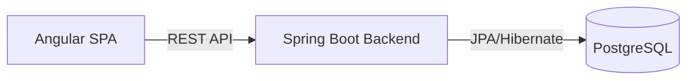

# Reservation Management System

A full-stack reservation system built with Java 25 (Spring Boot) and Angular 21. This project provides a robust solution for managing service bookings with real-time availability checks and a responsive user interface.

## System Architecture

The application implements a decoupled client-server architecture to ensure scalability and separation of concerns.



### Core Components

- **Backend**: Spring Boot 4 ecosystem leveraging Jakarta Persistence for data integrity and Lombok for boilerplate reduction.
- **Frontend**: Angular 21 utilizing RxJS for asynchronous reactive state management.
- **Database**: PostgreSQL 16+ integration.

## Technical Specifications

### Backend (Java / Spring Boot)

The backend is structured into domain-driven packages:
- `controller`: REST endpoints for reservation orchestration.
- `service`: Business logic layer implementing transaction management and validation rules.
- `entity`: Persistence models mapped via JPA.
- `exception`: Centralized error handling providing semantic HTTP responses.

**Key Endpoints:**
- `GET /reservas`: Comprehensive list of all system reservations.
- `POST /reservas`: Secure booking creation with conflict detection.
- `DELETE /reservas/{id}`: Soft-cancellation of existing records.

### Frontend (Angular)

The frontend architecture follows a feature-based module structure:
- `features/reservations`: Encapsulates booking listing and creation logic.
- `shared`: Common components and utility services.
- `services`: Clean abstraction over standard `HttpClient` for API communication.

## Configuration and Deployment

### Environment Variables

The backend supports dynamic configuration via environment variables:
- `DB_URL`: JDBC connection string.
- `DB_USER`: Database authentication username.
- `DB_PASSWORD`: Database authentication password.

### Development Setup

**Backend Initialization:**
```bash
cd backend
./mvnw spring-boot:run
```

**Frontend Initialization:**
```bash
cd frontend
npm install
npm start
```

## Security and Integrity

- **Generic Exception Shielding**: Prevents internal stack trace leakage.
- **Data Validation**: Strict enforcement of business rules at both API and Service layers.
- **CORS Configuration**: Controlled access for cross-origin resource sharing between development environments.
